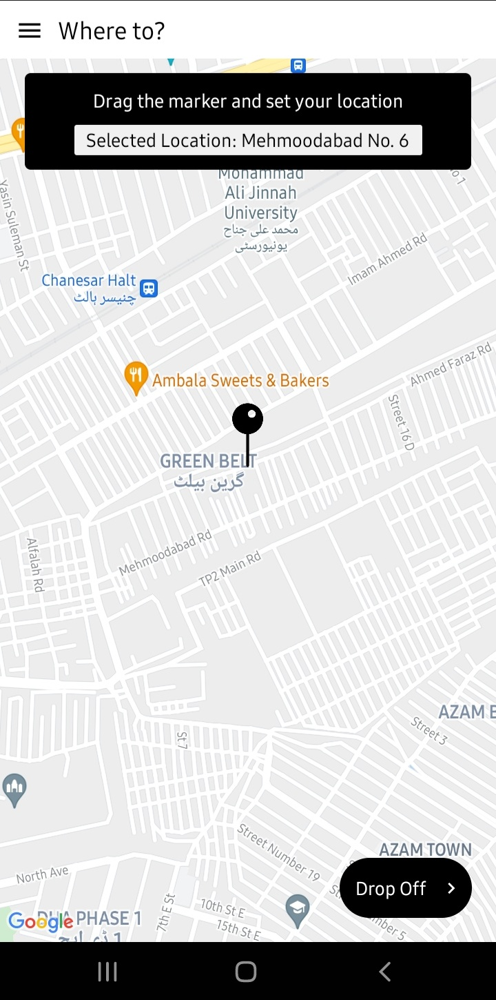
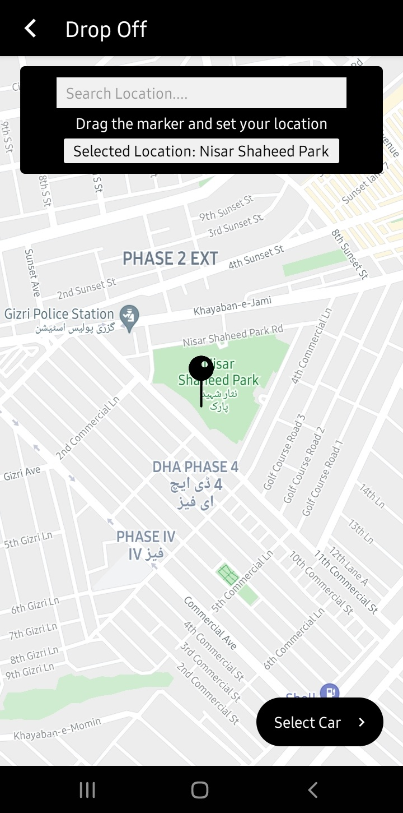
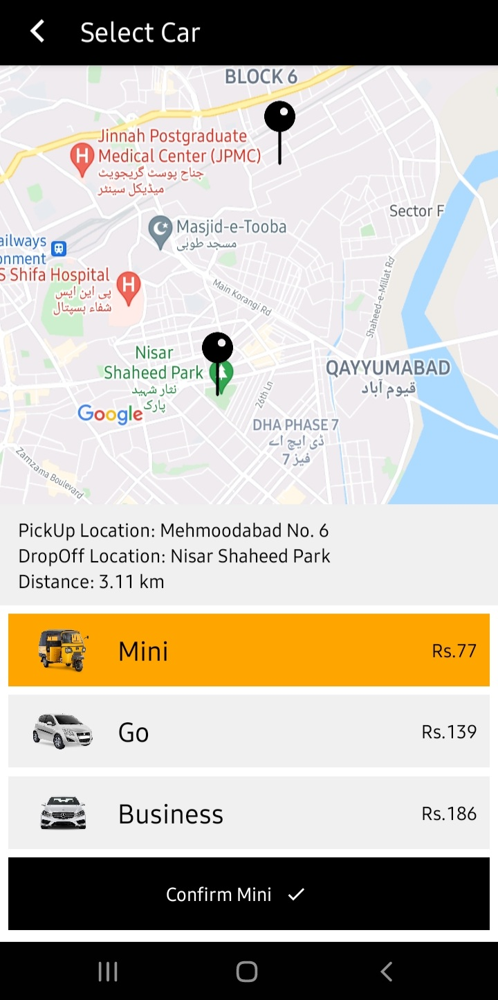
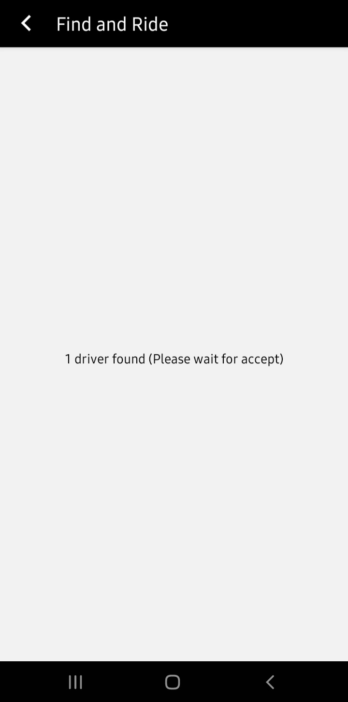
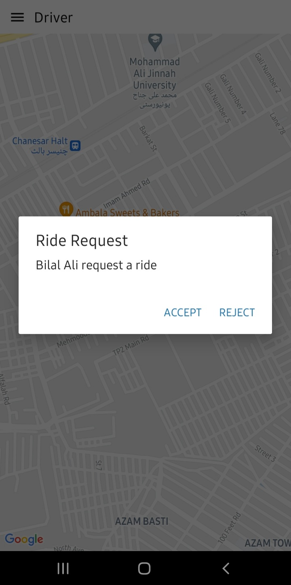
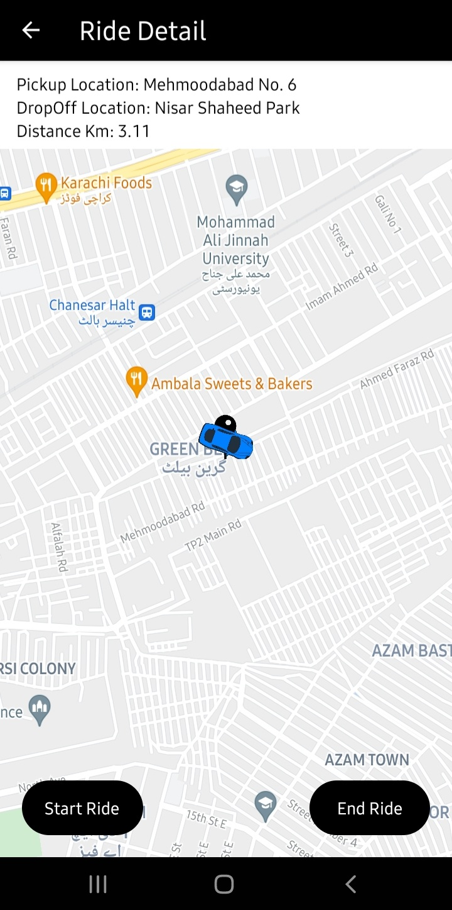
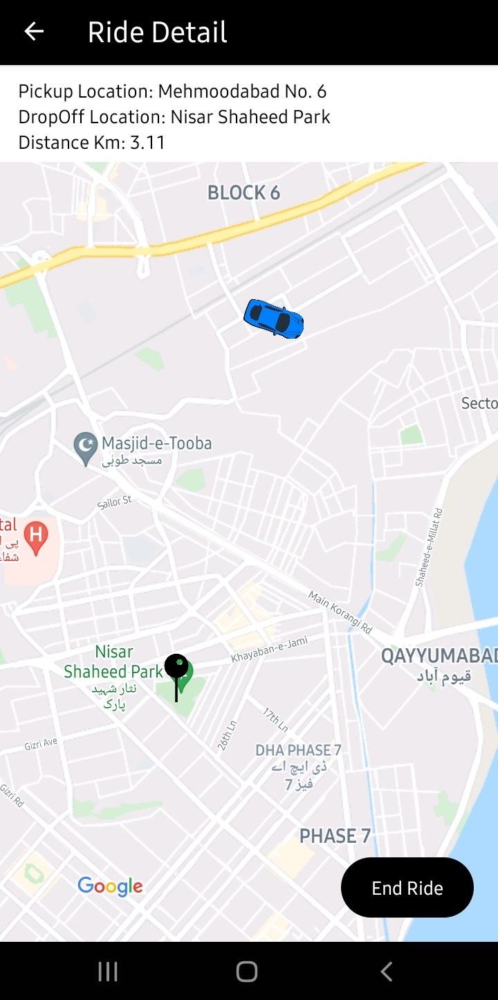
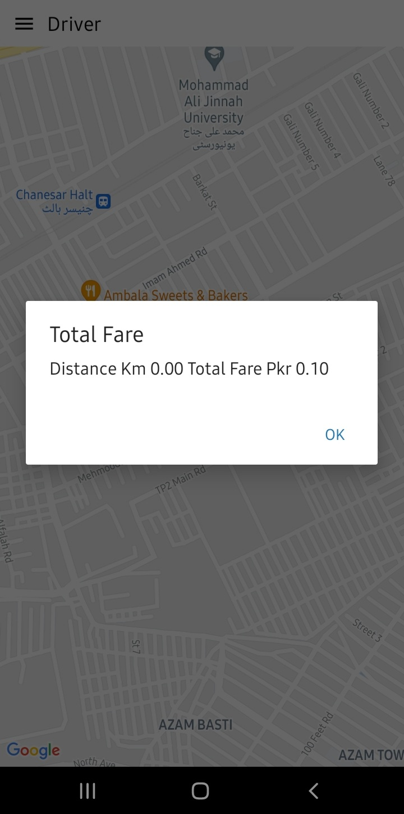

# Ride App -- React Native, Firebase

The uber-like ride-hailing app was build using React Native and Firebase.
Consist of two sub-apps, one for clients to book ride and another one for the drivers.

## Client

## Driver

